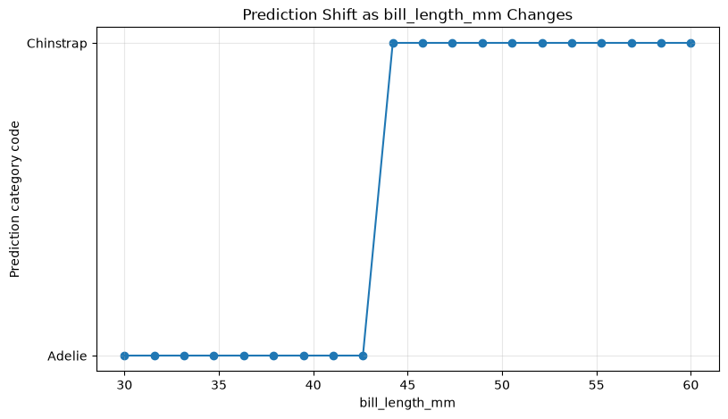

# ml-07-applied

[](https://denisecase.github.io/pro-analytics-02/workflow-b-apply-example-project/)
[](./pyproject.toml)
[](./LICENSE)

> Professional Python project: investigating deployed machine learning and cognitive-service-style model results.

## Project Description

This project focuses on learning to interrogate deployed and API-based machine learning systems by probing them systematically with different inputs and reviewing structured results.

We learn to:

- call a live prediction API from a notebook
- vary input features and observe how predictions change
- add retry and timeout handling for sleeping deployed servers
- identify decision boundaries and edge cases
- store and flatten API-style JSON responses
- create DataFrames and visuals from model responses
- log notebook results to `project.log`
- interpret model behavior from the outside

## Example Notebook + My Notebooks

The original example notebook is kept as a reference. I added two notebooks for my technical modification and custom applied investigation.

Links:

- [ml_07_case.ipynb](notebooks/ml_07_case.ipynb)
- [ml_07_femi.ipynb](notebooks/ml_07_femi.ipynb)
- [ml_07_text_and_image_femi.ipynb](notebooks/ml_07_text_and_image_femi.ipynb)

## Working Files

Most of the work for this project appears in these areas:

- **notebooks/** - interactive analysis notebooks
- **docs/** - project narrative and documentation
- **docs/images/** - saved charts and visuals
- **src/mlstudio/** - example application used for environment verification
- **project.log** - evidence that the notebooks and project workflows ran
- **pyproject.toml** - project metadata, dependencies, and tool settings
- **zensical.toml** - documentation site settings

## Additional Packages

This project uses `requests` to call the deployed API. It also uses common data and visualization packages such as `pandas`, `matplotlib`, and `seaborn`.

The notebooks use structured logging with `LOG.info(...)` so their results are written to `project.log`.

## Instructions (pro-analytics-02)

Follow the
[step-by-step workflow guide](https://denisecase.github.io/pro-analytics-02/workflow-b-apply-example-project/)
to complete:

1. Phase 1. **Start & Run**
2. Phase 2. **Change Authorship**
3. Phase 3. **Read & Understand**
4. Phase 4. **Modify**
5. Phase 5. **Apply**

## Technical Modification

The first custom notebook is:

- `notebooks/ml_07_femi.ipynb`

This notebook applies new skills by:

- calling a live prediction API with `requests`
- adding retry and timeout handling for sleeping deployed servers
- creating structured DataFrames from API responses
- running a feature sweep to find a decision shift
- testing edge cases and API error handling
- saving visuals to `docs/images/`
- logging notebook progress and summary results to `project.log`

The project log showed that the deployed Penguin API could return timeout messages when the server may have been sleeping.
This modification improves the workflow by documenting those issues and making the notebook more reliable.

## Custom Applied Project

The second custom notebook is:

- `notebooks/ml_07_text_and_image_femi.ipynb`

This notebook applies new skills to text and image analysis results by:

- storing API-style JSON responses in Python dictionaries
- flattening image label JSON into DataFrames
- comparing good, incomplete, and interesting image results
- summarizing confidence values
- creating visuals from label and sentiment results
- saving charts to `docs/images/`
- logging notebook progress and summary results to `project.log`

## Command Reference

<details>
<summary>Show command reference</summary>

### In a machine terminal, open your Repos folder

```shell
# Replace username with your GitHub username if needed.
git clone https://github.com/Airfirm/ml-07-applied
cd ml-07-applied
code .
```

### In a VS Code terminal

```shell
uv self update
uv python pin 3.14
uv lock --upgrade
uv sync --extra dev --extra docs --upgrade

uvx pre-commit install
uvx pre-commit autoupdate

# run the example module to verify the environment
uv run python -m mlstudio.app_case

# run checks
uv run ruff format .
uv run ruff check . --fix
uv run python -m pyright
uv run python -m pytest
uv run python -m zensical build

# save progress
git add -A
git commit -m "update module 7 technical modification"
git push -u origin main
```

</details>

## Findings and Visuals

The `ml_07_femi.ipynb` notebook investigated the deployed Penguin prediction API. The feature sweep showed that predictions changed from **Adelie** to **Chinstrap** around `bill_length_mm = 42.631579`.



The edge case chart summarized which API tests returned predictions and which produced an error. A missing feature produced a `400 Bad Request`, while unusual numeric values still returned predictions.


The `ml_07_text_and_image_femi.ipynb` notebook analyzed API-style image and text results. The image label chart shows top confidence values from good, incomplete, and interesting examples.


The sentiment chart summarizes confidence values from text sentiment examples.


## Project Log Evidence

Both custom notebooks include logging code like:

```python
LOG.info("Confirming installation:")
LOG.info(f"  python:       {platform.python_version()}")
LOG.info(f"  pandas:       {package_version('pandas')}")
LOG.info(f"  numpy:        {package_version('numpy')}")
LOG.info(f"  matplotlib:   {package_version('matplotlib')}")
LOG.info(f"  seaborn:      {package_version('seaborn')}")
LOG.info(f"  requests:     {package_version('requests')}")
```

After running both notebooks, `project.log` should include notebook start lines, package versions, API results, saved visual names, and final success messages.

## Challenges

The main challenge was working with a live deployed API. The server can sleep or time out, so the notebook needed retry and timeout handling.
Another challenge was making sure notebook logging wrote to the root `project.log` even when the notebook was executed from inside the `notebooks/` folder.

## Notes

- Use **Run All** in each notebook so every logging and visualization cell runs.
- Check the log with `Get-Content project.log -Tail 100` in PowerShell.
- Saved visuals appear in `docs/images/`.
- Do not remove the logging cells because they provide project evidence.

## Project Documentation

Additional project instructions, terms, and notes:

[docs/index.md](docs/index.md)

## Citation

[CITATION.cff](./CITATION.cff)

## License

[MIT](./LICENSE)
